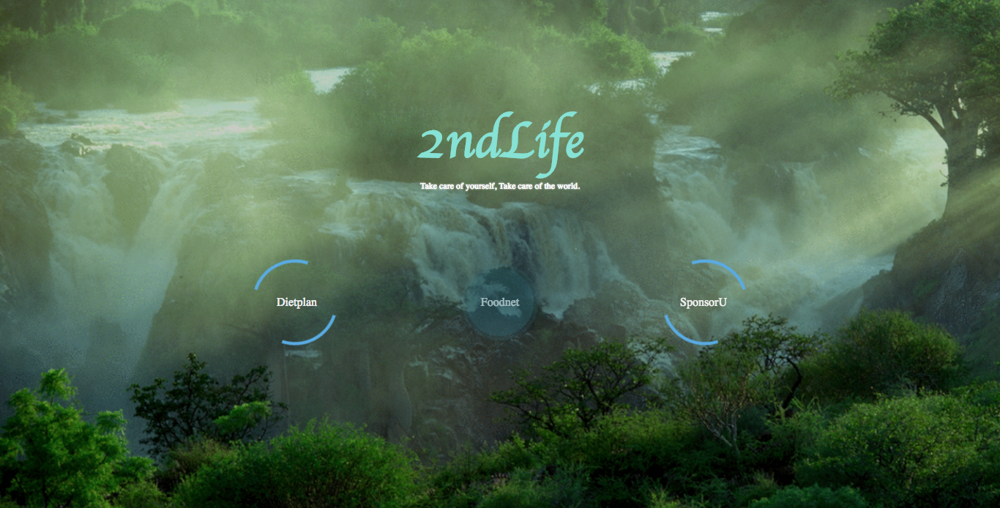

# 2ndLife (Godan Hackathon:)
Is a web-application that allows you to access and use open data easily to make healthier choices while also promoting environmently friendly companies by being connecting consumers to the right companies. It comes provides the user with three options where you can request a curated healthy diet, a map/listing of where good food comes from globally, and an option to sponsor the nearest protein farm/company which will create more sustainable and alternative proteins. 

The idea is that by giving a means of easily access, educate, and point the user in a direction that will benefit them and our food system. ~ <b>"Take care of yourself, Take care of the world!"</b>

#Open Data Challenge
This hackathon aims to answer the following challenge:

How might we allow for better utilization, collection, and/or accessibility to open data such that we can improve our food system and our chances at food security?

I decided to seek a solution to the following issues:

- Empower the Crowd: Using open data to improve how we leverage the crowd’s actions and knowledge to create a better food system.
- Improve Nutrition and Health: Using open data to improve how we track, make available, and improve nutrition in our daily diets.
- Meet the Protein Frontier: Using open data to improve how we address the growing demand for protein, and the opportunity for more sustainable and alternative proteins.

# API
[CKAN API](http://docs.ckan.org/en/latest/api/): allows you to easily organize, publish, and find data

# Additional Info
[Godan Hackathon](http://www.godan.info/pages/odc/open-data-hackathon)
[Open Data Source](http://www.godan.info/pages/odc/open-data)
[What is Open Data?](https://data.blog.gov.uk/2013/11/04/a-simple-intro-to-open-data/)
